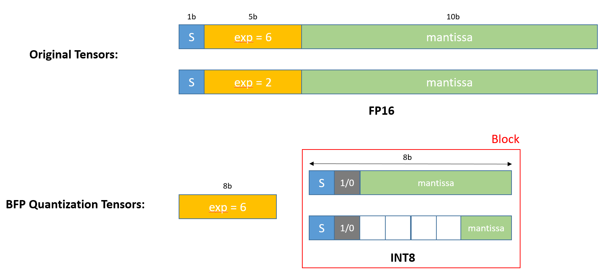

# BFP Quantization

## Introduction
Block Floating Point (BFP) quantization is a technique used to reduce the memory and computational requirements of neural networks while maintaining accuracy. Unlike traditional fixed-point quantization, BFP quantization groups elements into blocks and shares an exponent within each block, enabling a balance between precision and efficiency.



## Features

- Implement cuda version of bfp quantization/dequantization
- Implement pure bitwise operation without division to accelerate computation 
- Integrated with Pytorch 
- (TODO) Integrated with ops like Linear, CNN and so on
- (TODO) Integrated with modules like flash-attention

## Installation

To use the BFP quantization library, install it via pip:

```bash
sh setup.sh
```

## Usage

### Basic Example

You can run example in [BFP quantization toy example](examples/bfp_quant_example.ipynb)

```python
import torch
import quantUtils

x = torch.rand((1, 2, 32), dtype=torch.float32, device="cuda")

# quantization
x_quant, x_scales = quantUtils.bfp_quantize(x, 16)

# dequantization
x_dequant = quantUtils.bfp_dequantize(x_quant, x_scales)
```